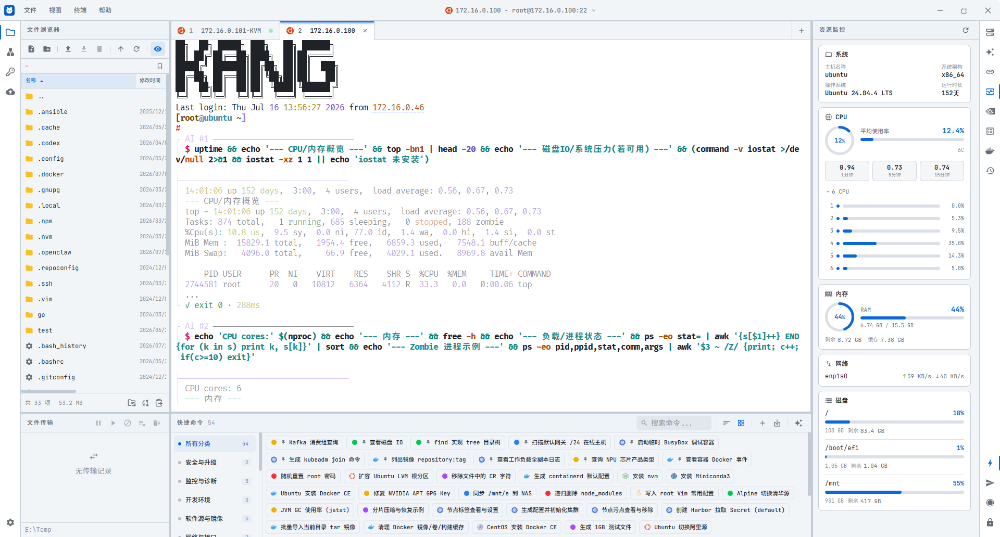

<p align="center">
  
</p>

<h1 align="center">NyaTerm</h1>

<p align="center">
  <strong>A modern remote terminal workspace built with Tauri, React, and Rust.</strong><br/>
  <a href="https://nyaterm.app"><strong>nyaterm.app</strong></a> ·
  <a href="https://nyaterm.app/docs/"><strong>Documentation</strong></a>
</p>

<p align="center">
  SSH, local shells, Telnet, Serial, SFTP, tunnels, OTP, AI assistance, and encrypted sync in one desktop client.
</p>

<p align="center">
  <a href="https://nyaterm.app"></a>
  &nbsp;
  <a href="#"></a>
  &nbsp;
  <a href="LICENSE"></a>
</p>

<p align="center">
  <a href="./README.md">English</a> · <a href="./README.zh-CN.md">简体中文</a>
</p>

---

<p align="center">
  <picture>
    <source media="(prefers-color-scheme: dark)" srcset="./docs-site/static/img/home/product-dark.png">
    <source media="(prefers-color-scheme: light)" srcset="./docs-site/static/img/home/product-light.png">
    
  </picture>
</p>

---

<a name="ai-assistant"></a>
# AI Assistant

NyaTerm includes an AI Assistant panel for command generation, terminal output explanation, error analysis, and multi-step terminal workflows.

## What It Can Do

- **Ask mode** for one-off help such as generating commands, explaining selected output, and analyzing errors
- **Agent mode** for multi-step work using an observe-decide-run loop against the active terminal session
- **Structured command cards** with risk levels, execution controls, and optional save-to-quick-command support
- **Session mentions** with `@` to bring other terminal sessions into the AI context
- **Provider management** for built-in providers and custom OpenAI-compatible endpoints
- **Risk control** for high-impact commands, including approval gates and safer alternatives

---

<a name="what-is-nyaterm"></a>
# What is NyaTerm

**NyaTerm** is a desktop client for SSH-centric operations and mixed terminal workflows. It combines a React + Tauri interface with a Rust backend so you can manage remote hosts, local shells, file transfers, authentication, network tooling, AI-assisted terminal actions, session import/export, diagnostics, and encrypted sync/backup from one workspace.

- **NyaTerm is** an SSH client for developers, sysadmins, and DevOps engineers
- **NyaTerm is** a terminal workspace with tabs, horizontal splits, and vertical splits
- **NyaTerm is** an SFTP browser with a transfer queue and local-edit-then-upload-back workflow
- **NyaTerm supports** SSH, Local Terminal, Telnet, and Serial sessions
- **NyaTerm is not** a shell replacement; it connects to remote shells, local shells, Telnet endpoints, and serial devices

---

<a name="why-nyaterm"></a>
# Why NyaTerm

NyaTerm is built for people who move between servers, local commands, devices, and configuration files all day.

- **Workspace-first** — keep related terminals together with tabs, split panes, side panels, and child windows
- **Remote operations in context** — browse SFTP files, follow terminal paths, run transfers, and edit remote files without leaving the session
- **Security-aware workflows** — manage credentials, keys, known hosts, OTP, lock screen, and master-password protected storage
- **Portable configuration** — import from existing tools, export encrypted `.dgfy` backups, and sync encrypted snapshots through WebDAV or S3-compatible storage
- **AI where it is useful** — generate commands, inspect output, and run approved multi-step actions from the active terminal context

---

<a name="features"></a>
# Features

## Sessions and Workspace

- SSH, Local Terminal, Telnet, and Serial session support
- Multi-tab workspace with horizontal and vertical pane splits
- Saved connections with folders, icons, metadata, duplication, reconnect, and import flows
- Left and right activity bars for file explorer, network, Security/Auth, Sync & Backup, AI Assistant, saved connections, active sessions, command history, and resource monitoring
- Child windows for settings, new-session creation, quick-command editing, and auto-upload prompts
- Tray support with optional minimize-to-tray behavior

## Terminal Experience

- Terminal search, copy/paste, context menus, and selected-text actions
- Command history with fuzzy suggestions and configurable length filters for noisy commands
- Optional line-number and timestamp gutter
- Optional action links for IPv4 addresses, `host:port`, and archive filenames
- Optional keyword highlighting with built-in presets and custom rules
- Large-output protection, configurable scrollback, SSH keep-alive, and session recording
- Online search and translation from selected terminal text
- Zmodem file transfer support directly from the terminal
- Customizable keyboard shortcuts for terminal and UI actions

## SFTP and File Workflows

- Built-in SFTP file explorer for SSH sessions
- Upload, download, rename, move, delete, properties, new file/folder, and symlink actions
- Folder upload, multi-select, editable path bar, and manual/automatic sync with terminal cwd
- Transfer queue with pause, resume, cancel, retry, timestamp preservation, and configurable concurrency
- Open remote files in a local editor and upload saved changes back through the watcher-driven auto-upload flow
- External drag-and-drop upload support on Windows

## Security, Authentication, and Networking

- Password authentication, private keys, host-key verification, and encrypted local persistence
- Credential management with regex-based terminal auto-fill
- OTP management with TOTP/HOTP, QR import, and SSH auto-fill support
- Proxy configurations, SSH jump hosts, and local / remote / dynamic tunnels
- Screen lock, master password, diagnostics settings, local log management, and diagnostics bundle export

## Sync, Backup, and Migration

- Encrypted cloud sync and backup through WebDAV and S3-compatible storage
- Master password required before sync, backup, encrypted import/export, or scheduled encrypted backup actions
- Startup sync checks, debounced auto-push after supported local changes, and scheduled backup retention
- Manual test / push / pull / backup actions, remote backup restore, and snapshot-level conflict resolution
- Session import from Xshell, MobaXterm, and WindTerm
- Full-app encrypted `.dgfy` import/export for portable NyaTerm configuration

---

<a name="screenshots"></a>
# Screenshots

## Workspace

Manage SSH, local shell, Telnet, and Serial sessions inside one tabbed and split-pane workspace.

<p align="center">
  <picture>
    <source media="(prefers-color-scheme: dark)" srcset="./docs-site/static/img/home/overview-dark.png">
    <source media="(prefers-color-scheme: light)" srcset="./docs-site/static/img/home/overview-light.png">
    
  </picture>
</p>

## Terminal Enhancements

Use command history, search, translation, action links, timestamps, keyword highlighting, and large-output protection in the terminal.

<p align="center">
  <picture>
    <source media="(prefers-color-scheme: dark)" srcset="./docs-site/static/img/home/terminal-dark.png">
    <source media="(prefers-color-scheme: light)" srcset="./docs-site/static/img/home/terminal-light.png">
    
  </picture>
</p>

## Remote Files

Browse SFTP files beside the terminal, manage transfers, and send local editor changes back to the remote path.

<p align="center">
  <picture>
    <source media="(prefers-color-scheme: dark)" srcset="./docs-site/static/img/home/files-dark.png">
    <source media="(prefers-color-scheme: light)" srcset="./docs-site/static/img/home/files-light.png">
    
  </picture>
</p>

## Security and Network Tools

Manage credentials, OTP, known hosts, proxies, jump hosts, and SSH tunnels from dedicated panels.

<p align="center">
  <picture>
    <source media="(prefers-color-scheme: dark)" srcset="./docs-site/static/img/home/security-dark.png">
    <source media="(prefers-color-scheme: light)" srcset="./docs-site/static/img/home/security-light.png">
    
  </picture>
</p>

## Sync and Backup

Sync encrypted portable configuration snapshots and restore backups through WebDAV or S3-compatible storage.

<p align="center">
  <picture>
    <source media="(prefers-color-scheme: dark)" srcset="./docs-site/static/img/home/sync-dark.png">
    <source media="(prefers-color-scheme: light)" srcset="./docs-site/static/img/home/sync-light.png">
    
  </picture>
</p>

---

<a name="supported-platforms"></a>
# Supported Platforms

| OS | Support |
| :--- | :--- |
| **Windows** | Windows 10/11, x64 / arm64 |
| **macOS** | macOS 12+, Intel / Apple Silicon |
| **Linux** | Ubuntu 20.04+, Fedora 36+, Arch Linux, and similar distributions |

Download installers from [nyaterm.app](https://nyaterm.app) or the [Releases](https://github.com/nyakang/nyaterm/releases) page.

---

<a name="supported-session-types"></a>
# Supported Session Types

| Type | Typical use | Notes |
|------|-------------|-------|
| SSH | Linux / Unix remote servers | Supports SFTP, OTP, resource monitor, proxy, jump host, and tunnels |
| Local Terminal | Local shell workflows | Uses your local shell path and working directory |
| Telnet | Legacy network devices or lab systems | Lightweight terminal session without SSH-only features |
| Serial | Routers, boards, embedded devices | Configurable port, baud rate, data bits, parity, and stop bits |

---

<a name="getting-started"></a>
# Getting Started

## Download

Download the latest build for your platform from [nyaterm.app](https://nyaterm.app) or [Releases](https://github.com/nyakang/nyaterm/releases).

| Platform | Format |
|----------|--------|
| Windows | `.msi` / `.exe` |
| macOS | `.dmg` |
| Linux | `.deb` / `.AppImage` |

## Prerequisites for Development

- Node.js 18+
- Rust stable via [rustup](https://rustup.rs/)
- pnpm

## Development

```bash
git clone https://github.com/nyakang/nyaterm.git
cd nyaterm
pnpm install
pnpm tauri dev
```

## Project Structure

```text
├── src/                    # React frontend
│   ├── components/         # UI, terminal, panels, dialogs, settings
│   ├── hooks/              # Frontend state and workflow hooks
│   ├── lib/                # Terminal, AI, sync, theme, platform helpers
│   ├── pages/              # Child-window pages
│   └── i18n/               # Application translations
├── src-tauri/              # Tauri 2 + Rust backend
│   ├── src/cmd/            # Tauri commands exposed to the frontend
│   ├── src/core/           # SSH, SFTP, PTY, Telnet, Serial, AI, backup logic
│   ├── src/config/         # Persistent config models
│   └── crates/otp/         # Local OTP implementation
├── docs-site/              # Docusaurus documentation site
├── public/                 # Static assets
└── scripts/                # Checks, version sync, and demo helper scripts
```

---

<a name="license"></a>
# License

This project is licensed under the [MIT License](LICENSE).
